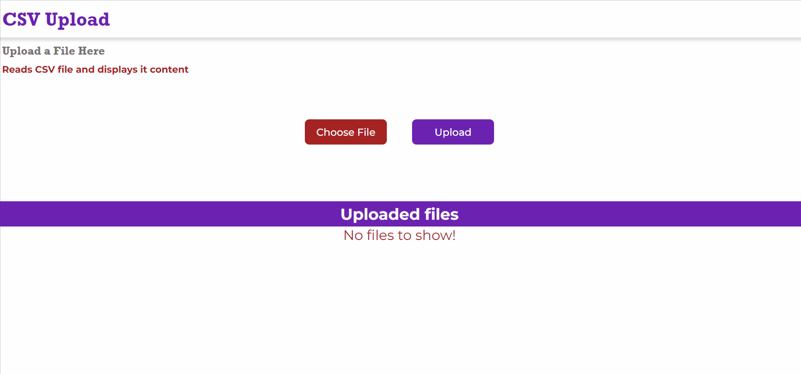

# Fullstack CSV Upload APP

Web application that allows users to load a CSV file and display it as cards in frontend. The application also includes a search bar to find data within the loaded CSV file.

[]

## INSTALLATION

To install this app, please follow these steps:

Clone this repository: https://github.com/lsegouras/fullstack-csv-upload-project.git

Install required dependencies: npm install

Start the application at frontend: npm run dev

Start the server at backend: npm run dev

Open the aplication in your browser: http://localhost:4000

## FEATURES

- CSV file upload
- CSV view: the app parses the CSV data and displays in cards.
- Search Bar: users can search data in the cards.

## TECHNOLOGIES

Frontend: React.js

Deps Frontend: react, react-dom, react-router-dom, react-scrips, nodemon

Backend: Node.js, Express.js

Deps Backend: body-parser, cors, csv-parser, dotenv, fs, monggose, multer, nodemon

Database: MongoDB

Icons - Fontawesome

IDE - Visual Studio Code
